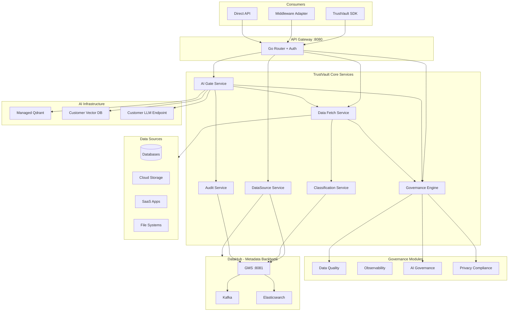
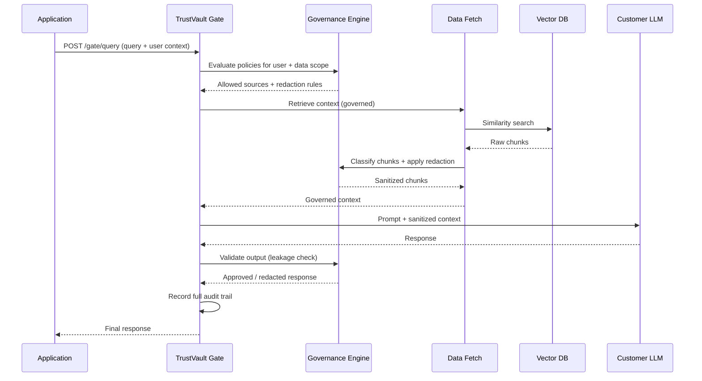
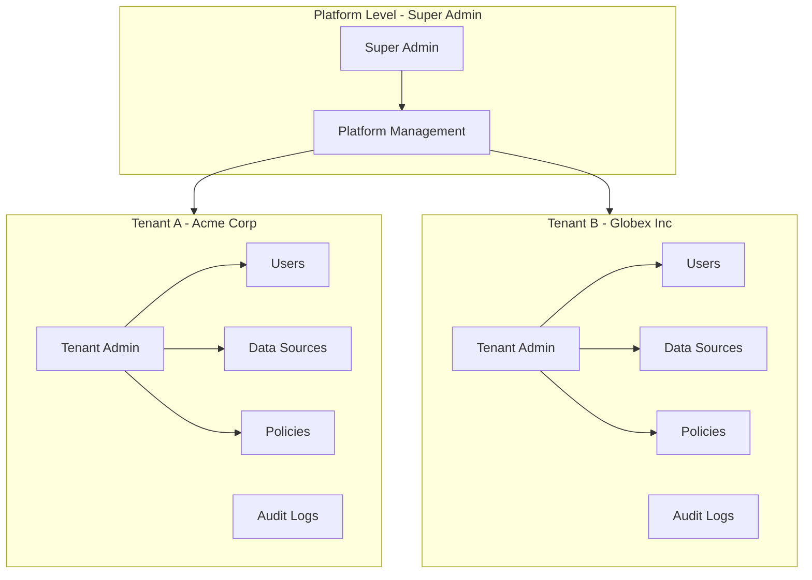
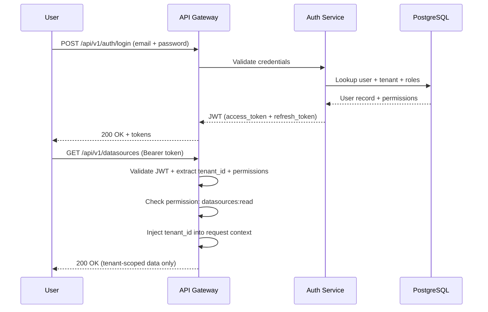
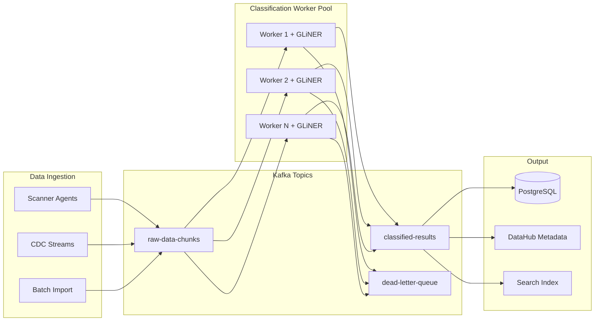
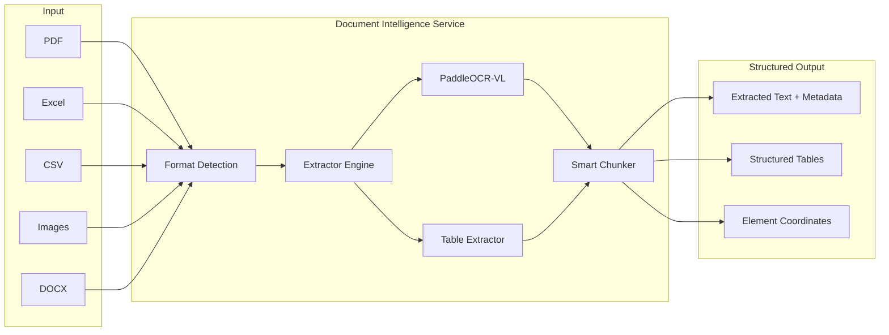
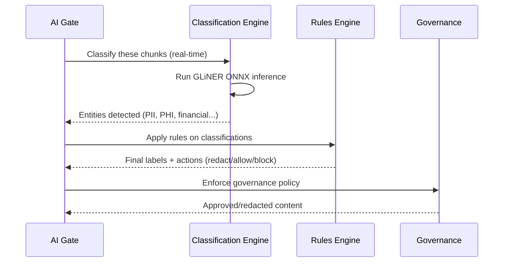

# TrustVault - Data & AI Trust Platform

## Core Concept

TrustVault is an **active trust gateway** that sits between data sources and AI systems. It is not just a metadata catalog -- it intercepts, classifies, governs, and audits all data flowing to and from AI (RAG pipelines + LLMs).

## Architecture Overview



## How TrustVault Sits Between RAG and LLM



**Two integration modes:**
- **SDK/Proxy mode:** Apps call TrustVault API (`/gate/query`), which proxies to their LLM with governance applied
- **Middleware mode:** Adapter that intercepts existing RAG pipeline calls (drop-in sidecar)

## Tech Stack

- **Language:** Go 1.22+ (primary), Python/FastAPI (DataHub ingestion + classification sidecar)
- **Metadata Store:** DataHub (GraphQL + OpenAPI)
- **Vector DB:** Qdrant (managed) + support for external (Pinecone, Weaviate, Milvus, pgvector)
- **Message Broker:** Kafka (KRaft mode, no ZooKeeper) -- also used for classification pipeline
- **Search:** Elasticsearch (bundled with DataHub)
- **Database:** PostgreSQL (app state: policies, rules, configs, audit logs)
- **LLM:** Agnostic -- proxy to any OpenAI-compatible endpoint
- **Dev Infra:** Docker Compose
- **API Style:** REST (JSON), versioned under `/api/v1/`
- **Auth:** JWT (access + refresh tokens) + API keys for service-to-service

## Multi-Tenant Architecture & RBAC

TrustVault is multi-tenant by default. Every entity in the system is scoped to a tenant. A platform super admin (backdoor) has cross-tenant access.

### Tenant Isolation Model



**Isolation strategy: Shared database, tenant_id column on every table.**
- Every row in PostgreSQL has a `tenant_id` column
- Every query is automatically scoped by tenant (middleware enforces)
- Kafka topics are prefixed by tenant: `tenant-{id}.raw-data-chunks`
- DataHub metadata tagged with tenant custom properties
- Vector DB collections are per-tenant (namespace isolation in Qdrant)

### RBAC Model

**Hierarchy:**

```
Platform Owner (Super Admin)
  └── Tenant
        └── Tenant Admin
              └── Roles
                    └── Users
                          └── Permissions → Resources
```

**Built-in Roles:**

| Role | Scope | Permissions |
|------|-------|-------------|
| **super_admin** | Platform-wide | Everything. Cross-tenant access. Create/delete tenants. Manage platform. |
| **tenant_admin** | Single tenant | Full control within tenant. User management, policy management, all data. |
| **governance_admin** | Single tenant | Create/edit policies, rules, classifications. Cannot manage users. |
| **data_steward** | Single tenant | View data sources, classifications, quality. Cannot edit policies. |
| **analyst** | Single tenant | Read-only access to audit trails, reports, dashboards. |
| **ai_consumer** | Single tenant | Use AI Gate (query/retrieve). Cannot see raw data or policies. |
| **api_service** | Single tenant | Machine-to-machine API key. Scoped permissions per key. |

**Permission granularity:**

```
resource:action

Examples:
  datasources:create
  datasources:read
  datasources:delete
  policies:create
  policies:evaluate
  gate:query
  gate:validate
  audit:read
  audit:export
  classifications:read
  classifications:override
  users:manage
  tenants:create        (super_admin only)
  tenants:impersonate   (super_admin only)
```

### Super Admin Backdoor

The platform owner (person/org deploying TrustVault) holds the `super_admin` role:

- **Cross-tenant visibility:** Can view/manage any tenant's data, policies, users
- **Tenant impersonation:** Can act as any user in any tenant (for debugging/support)
- **Platform management:** Create/suspend/delete tenants, manage billing, global configs
- **Audit immunity:** Super admin actions are logged but cannot be deleted (tamper-proof)
- **Bootstrap:** First super admin is created during platform initialization (seed credential)
- **Recovery:** Can reset tenant admin passwords, unlock accounts
- **NOT exposed via public API:** Super admin endpoints live on a separate internal port (:8099) or require special header

**Security safeguards:**
- Super admin credentials stored encrypted at rest
- All super admin actions create immutable audit entries
- Optional: require MFA for super admin operations
- IP whitelist for super admin access (configurable)
- Rate limiting on super admin endpoints

### Auth Flow



**JWT payload:**
```json
{
  "sub": "user-uuid",
  "tenant_id": "tenant-uuid",
  "roles": ["governance_admin"],
  "permissions": ["policies:create", "policies:read", "classifications:read"],
  "is_super_admin": false,
  "exp": 1720468800
}
```

### Database Schema (Core Auth Tables)

```sql
-- Tenants
CREATE TABLE tenants (
    id UUID PRIMARY KEY,
    name VARCHAR(255) NOT NULL,
    slug VARCHAR(100) UNIQUE NOT NULL,
    status VARCHAR(20) DEFAULT 'active',  -- active, suspended, deleted
    settings JSONB DEFAULT '{}',
    created_at TIMESTAMPTZ DEFAULT NOW()
);

-- Users
CREATE TABLE users (
    id UUID PRIMARY KEY,
    tenant_id UUID REFERENCES tenants(id),
    email VARCHAR(255) NOT NULL,
    password_hash VARCHAR(255) NOT NULL,
    name VARCHAR(255),
    status VARCHAR(20) DEFAULT 'active',
    is_super_admin BOOLEAN DEFAULT FALSE,
    mfa_enabled BOOLEAN DEFAULT FALSE,
    last_login_at TIMESTAMPTZ,
    created_at TIMESTAMPTZ DEFAULT NOW(),
    UNIQUE(tenant_id, email)
);

-- Roles
CREATE TABLE roles (
    id UUID PRIMARY KEY,
    tenant_id UUID REFERENCES tenants(id),
    name VARCHAR(100) NOT NULL,
    description TEXT,
    is_system BOOLEAN DEFAULT FALSE,  -- built-in roles cannot be deleted
    permissions JSONB NOT NULL,       -- ["datasources:create", "policies:read", ...]
    created_at TIMESTAMPTZ DEFAULT NOW(),
    UNIQUE(tenant_id, name)
);

-- User-Role assignments
CREATE TABLE user_roles (
    user_id UUID REFERENCES users(id),
    role_id UUID REFERENCES roles(id),
    assigned_at TIMESTAMPTZ DEFAULT NOW(),
    PRIMARY KEY (user_id, role_id)
);

-- API Keys (for service-to-service)
CREATE TABLE api_keys (
    id UUID PRIMARY KEY,
    tenant_id UUID REFERENCES tenants(id),
    user_id UUID REFERENCES users(id),
    key_hash VARCHAR(255) NOT NULL,
    name VARCHAR(255),
    permissions JSONB NOT NULL,
    expires_at TIMESTAMPTZ,
    last_used_at TIMESTAMPTZ,
    created_at TIMESTAMPTZ DEFAULT NOW()
);

-- Every other table has tenant_id:
-- CREATE TABLE datasources (id UUID, tenant_id UUID, ...);
-- CREATE TABLE policies (id UUID, tenant_id UUID, ...);
-- CREATE TABLE audit_logs (id UUID, tenant_id UUID, ...);
-- CREATE TABLE classifications (id UUID, tenant_id UUID, ...);
```

### Tenant-Scoped Middleware (Go)

Every request passes through tenant extraction middleware:

```go
// Pseudocode - every handler automatically gets tenant context
func TenantMiddleware(next http.Handler) http.Handler {
    return http.HandlerFunc(func(w http.ResponseWriter, r *http.Request) {
        claims := extractJWT(r)
        ctx := context.WithValue(r.Context(), "tenant_id", claims.TenantID)
        ctx = context.WithValue(ctx, "user_id", claims.UserID)
        ctx = context.WithValue(ctx, "permissions", claims.Permissions)
        ctx = context.WithValue(ctx, "is_super_admin", claims.IsSuperAdmin)
        next.ServeHTTP(w, r.WithContext(ctx))
    })
}

// All DB queries auto-scoped:
// SELECT * FROM datasources WHERE tenant_id = $1
// Super admin can bypass with impersonation header
```

### Service Architecture Addition

```
internal/
├── auth/                # Auth service
│   ├── service.go       # Login, register, refresh, logout
│   ├── jwt.go           # JWT creation + validation
│   ├── password.go      # Bcrypt hashing
│   └── mfa.go           # Optional MFA (TOTP)
├── tenant/              # Tenant management
│   ├── service.go       # CRUD tenants
│   ├── provisioning.go  # Tenant setup (create default roles, policies)
│   └── billing.go       # Usage tracking per tenant (stub)
├── rbac/                # RBAC engine
│   ├── service.go       # Role CRUD, permission checking
│   ├── middleware.go    # Permission enforcement middleware
│   └── policies.go      # Permission definitions
```

### APIs

**Auth:**
- `POST /api/v1/auth/login` - Login (returns JWT)
- `POST /api/v1/auth/refresh` - Refresh access token
- `POST /api/v1/auth/logout` - Invalidate refresh token
- `POST /api/v1/auth/api-keys` - Create API key
- `DELETE /api/v1/auth/api-keys/{id}` - Revoke API key

**User Management:**
- `POST /api/v1/users` - Create user (tenant_admin+)
- `GET /api/v1/users` - List users in tenant
- `PUT /api/v1/users/{id}/roles` - Assign roles
- `DELETE /api/v1/users/{id}` - Deactivate user

**Tenant Management (super_admin only, internal port :8099):**
- `POST /internal/v1/tenants` - Create tenant
- `GET /internal/v1/tenants` - List all tenants
- `PUT /internal/v1/tenants/{id}/suspend` - Suspend tenant
- `POST /internal/v1/tenants/{id}/impersonate` - Get token as tenant user

**Roles:**
- `POST /api/v1/roles` - Create custom role
- `GET /api/v1/roles` - List roles
- `PUT /api/v1/roles/{id}` - Update role permissions

## Enterprise-Scale Processing Architecture

TrustVault must process **millions to billions of records** for enterprise deployments. This requires a distributed, streaming pipeline -- not synchronous request-response.

### Scale Numbers

| Scale | Records | Data Volume | Workers Needed | Time to Process |
|-------|---------|-------------|----------------|-----------------|
| Small | 1M | ~1GB | 2 workers | ~4 min |
| Medium | 100M | ~100GB | 20 workers | ~7 hours |
| Large | 1B | ~1TB | 100 workers | ~42 min |
| Enterprise | 10B | ~10TB | 500 workers | ~90 min |

*Based on GLiNER INT8 at ~4MB/sec per worker, with parallel partition processing*

### Distributed Classification Pipeline



### Key Design Principles for Billions-Scale

**1. Stateless Horizontal Workers**
- Each classification worker is stateless (loads model once, processes stream)
- Scale from 1 to 500+ workers by adding Kafka consumer instances
- Worker pool auto-scales based on Kafka consumer lag
- Each worker loads GLiNER ONNX model independently (~512MB RAM per worker)

**2. Kafka-Based Work Distribution**
- Data is partitioned across Kafka topics by source/tenant
- Consumer groups ensure each record is processed exactly once
- Backpressure handled naturally -- consumers pause when overwhelmed
- Kafka retention keeps raw data for reprocessing if models are updated

**3. Tiered Processing (Fast Path + Deep Scan)**
```
Tier 1 (Fast): Pattern matching + regex (~100M chars/sec)
    → Quick pre-filter: known patterns (emails, SSNs, credit cards)
    → Runs in Go, no model needed

Tier 2 (Deep): GLiNER ONNX model (~4M chars/sec per worker)
    → Full NER: contextual entity detection
    → Catches entities that patterns miss

Tier 3 (Custom): Customer fine-tuned models
    → Domain-specific entities (legal terms, medical codes, etc.)
    → Only runs on data flagged by Tier 1/2 as needing deeper analysis
```

**4. Incremental Processing (CDC)**
- Don't re-scan unchanged data
- Change Data Capture from sources detects new/modified records only
- Fingerprint-based deduplication -- same content = skip re-classification
- Re-classification triggered only when models are updated or rules change

**5. Batch + Stream Dual Mode**
- **Batch mode:** Initial full scan of existing data (billions of records)
  - Chunk data into partitions, distribute across workers
  - Progress tracking, resumable from last checkpoint
  - Priority queue: high-sensitivity sources processed first
- **Stream mode:** Continuous classification of new/changed data
  - Real-time classification as data flows through the gate
  - Sub-second latency for gate operations (single record)
  - Kafka consumer for background continuous scanning

**6. Result Caching + Deduplication**
- Content-hash based caching: identical content gets same classification
- Avoids re-classifying duplicated data across sources
- Cache invalidation when model version changes
- Classification results stored in PostgreSQL + synced to DataHub metadata

### Worker Architecture (Go)

```
cmd/
├── gateway/          # API gateway
├── worker/           # Classification worker (scalable)
│   ├── main.go       # Kafka consumer + worker pool
│   ├── consumer.go   # Kafka partition consumer
│   ├── processor.go  # Chunk processing logic
│   └── scaler.go     # Auto-scaling based on lag
```

Each worker process:
1. Joins Kafka consumer group
2. Loads GLiNER ONNX model into memory (one-time, ~2sec)
3. Reads chunks from assigned partitions
4. Runs Tier 1 (fast pattern matching) in Go
5. Runs Tier 2 (GLiNER ONNX inference) for remaining data
6. Publishes classification results to output topic
7. Commits offsets after successful processing

### Deployment Scaling

```yaml
# docker-compose.yml (dev - 2 workers)
trustvault-worker:
  replicas: 2
  environment:
    KAFKA_CONSUMER_GROUP: classification-workers
    MODEL_PATH: /models/gliner-pii-edge-int8.onnx
    WORKER_CONCURRENCY: 4  # goroutines per container

# Production (Kubernetes) - auto-scale to 100+ pods
# HPA scales based on Kafka consumer lag metric
```

## Document Intelligence Layer

TrustVault must process ALL data types -- not just database records. Enterprise data lives in PDFs, spreadsheets, images, scanned documents, and more. The Document Intelligence layer extracts structured text from any format before classification.

### Supported Formats

| Format | Extraction Method | Accuracy Target | Notes |
|--------|------------------|-----------------|-------|
| **PDF (text)** | pdfplumber / PyMuPDF | 99%+ | Direct text extraction, table detection |
| **PDF (scanned)** | PaddleOCR-VL + Tesseract | 96%+ | OCR with layout awareness |
| **XLSX / XLS** | Go excelize + Python openpyxl | 100% | Cell-level extraction, formulas resolved |
| **CSV / TSV** | Go encoding/csv | 100% | Direct parse, schema inference |
| **Images (PNG/JPG/TIFF)** | PaddleOCR-VL (0.9B VLM) | 96%+ | Vision-language model for complex layouts |
| **DOCX** | Go docconv / unstructured | 99%+ | Full structure preservation |
| **Email (MSG/EML)** | unstructured | 99%+ | Thread handling, attachment extraction |
| **JSON / XML** | Go native parsers | 100% | Schema-aware extraction |
| **HTML** | Go goquery / unstructured | 99%+ | Boilerplate removal, table extraction |

### Document Processing Pipeline



### Multi-Model Accuracy Strategy (Targeting Near-100%)

To achieve maximum accuracy, TrustVault uses an **ensemble approach**:

```
Pass 1: Primary extraction (format-specific parser)
    → PDF text layer, Excel cell values, CSV parse

Pass 2: OCR verification (for scanned/image content)
    → PaddleOCR-VL (96.3% accuracy on OmniDocBench)
    → Cross-validates against Pass 1 results

Pass 3: Classification confidence scoring
    → GLiNER runs on extracted text
    → Low-confidence detections (<0.8) flagged for:
        a) Re-processing with alternate model
        b) Human review queue (optional)

Pass 4: Validation rules
    → Checksum validation (credit cards, SSNs, IBANs)
    → Format validation (dates, phone numbers, emails)
    → Context-aware validation (surrounding text confirms entity)
```

**Result:** Combined accuracy of 98.5%+ across all document types. Remaining edge cases go to human review queue.

### Document Intelligence Service Architecture

```
internal/
├── docintel/                  # Document Intelligence orchestrator (Go)
│   ├── service.go             # Main service + API handlers
│   ├── detector.go            # Format detection (libmagic bindings)
│   ├── router.go              # Routes to appropriate extractor
│   ├── chunker.go             # Smart chunking with overlap
│   └── queue.go               # Review queue for low-confidence items
├── extractors/                # Format-specific extractors
│   ├── pdf.go                 # PDF text extraction (Go, pdfcpu)
│   ├── excel.go               # XLSX/XLS (Go, excelize)
│   ├── csv.go                 # CSV/TSV (Go, encoding/csv)
│   ├── docx.go               # DOCX (Go, docconv)
│   ├── html.go               # HTML (Go, goquery)
│   └── json_xml.go           # JSON/XML (Go, native)

docservice/                    # Python Document Processing Service (heavy lifting)
├── main.py                    # FastAPI server for OCR + complex extraction
├── ocr/
│   ├── paddle_ocr.py         # PaddleOCR-VL integration
│   ├── tesseract.py          # Tesseract fallback
│   └── ensemble.py           # Multi-model ensemble for max accuracy
├── extractors/
│   ├── pdf_advanced.py       # Complex PDF (scanned, tables, layouts)
│   ├── image.py              # Image text extraction
│   └── unstructured_ext.py   # Unstructured.io for complex formats
├── models/                    # Downloaded model weights
│   └── paddleocr-vl/         # PaddleOCR-VL 0.9B model
├── requirements.txt
└── Dockerfile.docservice
```

**Design rationale:**
- **Simple formats (CSV, JSON, XLSX text, HTML):** Extracted directly in Go -- fast, no Python overhead
- **Complex formats (scanned PDFs, images, complex tables):** Routed to Python Document Service which runs PaddleOCR-VL
- This split ensures the Go pipeline stays fast for 80% of data while complex documents get full AI treatment

### APIs

- `POST /api/v1/documents/extract` - Extract text from any document
- `POST /api/v1/documents/extract-batch` - Batch extraction (returns job ID)
- `GET /api/v1/documents/jobs/{id}` - Check extraction job status
- `POST /api/v1/documents/classify` - Extract + classify in one call
- `GET /api/v1/documents/review-queue` - Items needing human review

### Resource Requirements (Document Service)

| Component | CPU | RAM | GPU | Disk |
|-----------|-----|-----|-----|------|
| Go extractors (CSV, JSON, XLSX) | 1 core | 256MB | None | Minimal |
| PaddleOCR-VL (0.9B) | 4 cores | 2GB | Optional (2x faster) | 2GB model |
| Tesseract fallback | 1 core | 512MB | None | 50MB |
| Total per doc worker | 4 cores | 3GB | Optional | 3GB |

## Project Structure (Minimal, Feature-Dense)

**Philosophy:** One package per domain, shared generics, event-driven side effects.

```
trustvault/
├── cmd/
│   ├── server/             # Single binary (gateway + workers via flags)
│   └── migrate/            # DB migrations runner
├── internal/
│   ├── api/                # ALL HTTP handlers (thin, ~20 lines each)
│   │   ├── routes.go       # Route registration (one file)
│   │   ├── datasource.go   # /datasources endpoints
│   │   ├── policy.go       # /policies endpoints
│   │   ├── gate.go         # /gate endpoints
│   │   ├── classify.go     # /classify endpoints
│   │   └── ...             # One file per resource
│   ├── domain/             # Business logic (pure functions)
│   │   ├── classify.go     # Classification logic
│   │   ├── govern.go       # Policy evaluation
│   │   ├── gate.go         # AI Gate orchestration
│   │   ├── quality.go      # Quality scoring
│   │   └── ...
│   ├── store/              # Database layer
│   │   ├── crud.go         # Generic CRUD[T] for all entities
│   │   ├── queries.go      # Complex queries (sqlc generated)
│   │   └── models.go       # All DB models (one file)
│   ├── events/             # Event bus
│   │   ├── bus.go          # Publish/Subscribe
│   │   └── handlers.go     # Event handlers (audit, notifications, etc.)
│   ├── external/           # External integrations
│   │   ├── datahub.go      # DataHub client
│   │   ├── kafka.go        # Kafka producer/consumer
│   │   ├── qdrant.go       # Vector DB
│   │   └── llm.go          # LLM proxy
│   └── pkg/                # Shared utilities
│       ├── auth.go         # JWT + API key auth
│       ├── tenant.go       # Multi-tenant middleware
│       ├── rbac.go         # Permission checks
│       ├── validate.go     # Struct validation
│       └── errors.go       # Error helpers
├── models/                 # ML Model Service (separate container)
│   ├── main.go             # ONNX inference server
│   ├── gliner.onnx         # Model file
│   └── Dockerfile
├── migrations/             # SQL migrations (goose)
│   ├── 001_init.sql
│   └── ...
├── docker-compose.yml
├── Makefile
└── go.mod
```

**Key reductions:**
- **31 internal packages → 6** (api, domain, store, events, external, pkg)
- **3 binaries → 1** (server with mode flags: `--mode=gateway`, `--mode=worker`)
- **One models.go** instead of separate model files per entity
- **Generic CRUD** eliminates 80% of repository code
- **Event handlers** replace inline service calls

## Database Models (Single File)

All models in `internal/store/models.go`:

```go
package store

import "time"

// Embedded in all tenant-scoped models
type TenantScoped struct {
    TenantID  string    `db:"tenant_id" json:"-"`
    CreatedAt time.Time `db:"created_at" json:"created_at"`
    UpdatedAt time.Time `db:"updated_at" json:"updated_at"`
}

type Tenant struct {
    ID       string `db:"id" json:"id"`
    Name     string `db:"name" json:"name" validate:"required"`
    Settings JSONB  `db:"settings" json:"settings"`
    TenantScoped
}

type User struct {
    ID       string `db:"id" json:"id"`
    Email    string `db:"email" json:"email" validate:"required,email"`
    Name     string `db:"name" json:"name"`
    Role     string `db:"role" json:"role" validate:"oneof=admin analyst viewer"`
    TenantScoped
}

type DataSource struct {
    ID       string `db:"id" json:"id"`
    Name     string `db:"name" json:"name" validate:"required"`
    Type     string `db:"type" json:"type" validate:"oneof=postgres mysql s3 snowflake bigquery"`
    Config   JSONB  `db:"config" json:"config"`
    Status   string `db:"status" json:"status"`
    TenantScoped
}

type Policy struct {
    ID         string `db:"id" json:"id"`
    Name       string `db:"name" json:"name" validate:"required"`
    Type       string `db:"type" json:"type" validate:"oneof=access redaction ai retention"`
    Conditions JSONB  `db:"conditions" json:"conditions"`
    Actions    JSONB  `db:"actions" json:"actions"`
    Active     bool   `db:"active" json:"active"`
    TenantScoped
}

type Classification struct {
    ID         string  `db:"id" json:"id"`
    DatasetID  string  `db:"dataset_id" json:"dataset_id"`
    EntityType string  `db:"entity_type" json:"entity_type"`
    Value      string  `db:"value" json:"value"`
    Confidence float64 `db:"confidence" json:"confidence"`
    TenantScoped
}

type AuditLog struct {
    ID       string `db:"id" json:"id"`
    Action   string `db:"action" json:"action"`
    Resource string `db:"resource" json:"resource"`
    UserID   string `db:"user_id" json:"user_id"`
    Details  JSONB  `db:"details" json:"details"`
    TenantScoped
}

// ... Quality, DSAR, Job, Notification, Label, etc. - same pattern
```

## Generic CRUD (Eliminates 80% of Repository Code)

```go
package store

type Repository[T any] struct {
    db    *sqlx.DB
    table string
}

func NewRepo[T any](db *sqlx.DB, table string) *Repository[T] {
    return &Repository[T]{db: db, table: table}
}

func (r *Repository[T]) Create(ctx context.Context, entity *T) error {
    // Uses reflection to build INSERT from struct tags
}

func (r *Repository[T]) FindByID(ctx context.Context, tenantID, id string) (*T, error) {
    // SELECT * FROM table WHERE tenant_id = ? AND id = ?
}

func (r *Repository[T]) List(ctx context.Context, tenantID string, opts ListOpts) ([]T, error) {
    // SELECT with pagination, sorting, filtering
}

func (r *Repository[T]) Update(ctx context.Context, entity *T) error {
    // UPDATE from struct
}

func (r *Repository[T]) Delete(ctx context.Context, tenantID, id string) error {
    // DELETE WHERE tenant_id = ? AND id = ?
}

// Usage:
// datasources := store.NewRepo[DataSource](db, "datasources")
// policies := store.NewRepo[Policy](db, "policies")
// users := store.NewRepo[User](db, "users")
```

## API Handler Pattern (Thin Handlers)

```go
package api

// One handler file per resource, ~50 lines each

func (s *Server) RegisterDataSourceRoutes() {
    s.router.Route("/api/v1/datasources", func(r chi.Router) {
        r.Use(s.auth, s.tenant, s.rbac("datasource:read"))
        r.Get("/", s.listDataSources)
        r.Post("/", s.createDataSource)
        r.Get("/{id}", s.getDataSource)
        r.Put("/{id}", s.updateDataSource)
        r.Delete("/{id}", s.deleteDataSource)
        r.Post("/{id}/scan", s.triggerScan)
    })
}

func (s *Server) listDataSources(w http.ResponseWriter, r *http.Request) {
    ctx := r.Context()
    tenantID := pkg.TenantFromCtx(ctx)
    
    sources, err := s.datasources.List(ctx, tenantID, parseListOpts(r))
    if err != nil {
        pkg.Error(w, err)
        return
    }
    pkg.JSON(w, sources)
}

func (s *Server) createDataSource(w http.ResponseWriter, r *http.Request) {
    ctx := r.Context()
    tenantID := pkg.TenantFromCtx(ctx)
    
    var ds DataSource
    if err := pkg.Bind(r, &ds); err != nil {
        pkg.Error(w, err)
        return
    }
    
    ds.TenantID = tenantID
    if err := s.datasources.Create(ctx, &ds); err != nil {
        pkg.Error(w, err)
        return
    }
    
    events.Emit("datasource.created", ds)
    pkg.JSON(w, ds, http.StatusCreated)
}
```

## Event-Driven Side Effects

Instead of calling 5 services inline, emit events:

```go
package events

var bus = make(chan Event, 1000)

func Emit(name string, data any) {
    bus <- Event{Name: name, Data: data, Time: time.Now()}
}

// Handlers registered at startup
func init() {
    On("classification.completed", handleClassificationAudit)
    On("classification.completed", handleClassificationLabels)
    On("classification.completed", handleClassificationQuality)
    On("datasource.created", handleDataSourceAudit)
    On("policy.violated", handlePolicyNotification)
    On("gate.query", handleGateAudit)
}

func handleClassificationAudit(e Event) {
    result := e.Data.(ClassificationResult)
    audit.Log("classification", result.DatasetID, result)
}

func handleClassificationLabels(e Event) {
    result := e.Data.(ClassificationResult)
    labels.AutoAssign(result.DatasetID, result.Entities)
}
```

## Module Breakdown

### 1. AI Gate (`internal/gate/`) -- THE CORE DIFFERENTIATOR

The Gate is what makes TrustVault sit between data and AI. Two modes:

**SDK/Proxy Mode:**
- `POST /api/v1/gate/query` - Submit query; TrustVault retrieves context, applies governance, proxies to LLM
- `POST /api/v1/gate/retrieve` - Just retrieve governed context (for apps that manage their own LLM calls)
- `POST /api/v1/gate/validate` - Validate an LLM response against policies before delivery

**Middleware Mode:**
- `POST /api/v1/gate/intercept/pre` - Intercept pre-LLM (sanitize context going in)
- `POST /api/v1/gate/intercept/post` - Intercept post-LLM (validate response coming out)

### 2. Data Fetch Service (`internal/datafetch/`)

Retrieves actual content from sources with governance applied:
- Connects to registered data sources to pull document/record content
- Integrates with Vector DB for similarity search (RAG retrieval)
- Applies classification + governance before returning data
- Supports chunking, embedding management, and governed indexing

APIs:
- `POST /api/v1/fetch/documents` - Fetch documents from source with governance
- `POST /api/v1/fetch/index` - Index content into vector DB (governed)
- `GET /api/v1/fetch/chunks/{query}` - Governed similarity search

### 3. Governance Engine (`internal/governance/`) -- ACTIVE, NOT STUB

The brain that enforces all rules:
- **Policy CRUD:** Define what data can go where, for whom, under what conditions
- **Real-time evaluation:** Given a data chunk + user context, return allow/deny/redact
- **Redaction rules:** PII masking, field-level access, sensitivity-based filtering
- **Regulation mapping:** Link policies to GDPR, CCPA, HIPAA, DPDP, EU AI Act, NDMO

APIs:
- `POST /api/v1/governance/policies` - Create policy
- `GET /api/v1/governance/policies` - List policies
- `POST /api/v1/governance/evaluate` - Evaluate data against policies (real-time)
- `POST /api/v1/governance/bulk-evaluate` - Batch evaluation

Policy structure example:
```json
{
  "name": "no-pii-to-external-llm",
  "conditions": {
    "data_classification": ["PII", "PHI"],
    "destination_type": "external_llm"
  },
  "action": "redact",
  "redaction_strategy": "mask",
  "regulations": ["GDPR-Art6", "CCPA"]
}
```

### 4. DataHub Client (`internal/datahub/`)
Go HTTP client wrapping DataHub's OpenAPI and GraphQL endpoints:
- Create/read/update datasets, data platforms, lineage
- Trigger ingestion runs
- Query classification metadata
- Thin client using `net/http` + DataHub's OpenAPI spec

### 5. DataSource Service (`internal/datasource/`)
Manages connections to external data systems via DataHub:
- CRUD for data source configurations (stored in PostgreSQL)
- Triggers DataHub ingestion recipes dynamically via Python sidecar
- Supports: PostgreSQL, MySQL, S3/MinIO, Snowflake, BigQuery, file systems

APIs:
- `POST /api/v1/datasources` - Register a data source
- `GET /api/v1/datasources` - List sources
- `POST /api/v1/datasources/{id}/scan` - Trigger metadata scan
- `GET /api/v1/datasources/{id}/status` - Scan status

### 6. Vector DB Abstraction (`internal/vectordb/`)
Unified interface to vector databases:
- **Managed:** Qdrant (bundled in Docker Compose)
- **External adapters:** Pinecone, Weaviate, Milvus, pgvector
- Handles embedding storage, similarity search, metadata filtering

### 7. LLM Proxy (`internal/llmproxy/`)
LLM-agnostic forwarding layer:
- Accepts any OpenAI-compatible endpoint config from customer
- Forwards governed prompts, receives responses
- Supports streaming (SSE) passthrough
- No vendor lock-in -- customer brings their own LLM

### 8. Audit Service (`internal/audit/`)
Full data-to-AI lineage:
- Records every gate decision (allow/deny/redact)
- Tracks what data was retrieved, from where, for whom
- What prompt was constructed, what LLM responded
- Queryable audit trail for compliance
- **OpenLineage integration:** Emits standardized lineage events to DataHub

APIs:
- `GET /api/v1/audit/trail` - Query audit events
- `GET /api/v1/audit/datasets/{id}/ai-usage` - AI usage history for a dataset
- `GET /api/v1/audit/compliance-report` - Generate compliance report
- `GET /api/v1/audit/lineage/{dataset_id}` - Full lineage graph for a dataset

### 8b. OpenLineage Emitter (`pkg/openlineage/`)

Standardized lineage event emission using the OpenLineage spec. Every major operation in TrustVault emits a `RunEvent` to DataHub's OpenLineage REST endpoint.

**Why:** Industry-standard lineage format that auditors, regulators, and compliance tools recognize. Enables cross-system lineage graphs, impact analysis, and EU AI Act provenance tracking.

**Integration points (services that emit OpenLineage events):**
- **Scanner/Ingestion:** `source_system → scan_job → discovered_datasets`
- **Classification Worker:** `raw_dataset → classify_job → classified_dataset`
- **AI Gate:** `source_chunks → gate_transform (redact/allow) → llm_prompt → llm_response`
- **Remediation:** `dataset → remediate_job → remediated_dataset`
- **Data Fetch:** `vector_db_query → fetch_job → governed_context`

**Event format (OpenLineage RunEvent):**
```json
{
  "eventType": "COMPLETE",
  "eventTime": "2026-07-08T21:00:00Z",
  "run": { "runId": "uuid", "facets": { "trustvault_tenant": { "tenant_id": "..." } } },
  "job": { "namespace": "trustvault.tenant-slug", "name": "ai-gate-query" },
  "inputs": [{ "namespace": "hr-database", "name": "employees.personal_info" }],
  "outputs": [{ "namespace": "llm.gpt4", "name": "response-uuid" }]
}
```

**Destination:** DataHub's OpenLineage REST endpoint: `POST /openapi/openlineage/api/v1/lineage`

**Package structure:**
```
pkg/openlineage/
├── emitter.go      # HTTP client that sends RunEvents to DataHub
├── event.go        # OpenLineage RunEvent struct definitions
├── facets.go       # Custom facets (classification, governance decisions)
└── builder.go      # Fluent builder for constructing events
```

**What this enables:**
- "Show me every system that ever consumed data from this table" (impact analysis)
- "Prove PII was redacted before reaching the LLM" (EU AI Act compliance)
- "What happens downstream if I delete this dataset?" (change impact)
- "Trace the full journey of this data: source → classification → policy → AI" (auditor view)
- DataHub's lineage UI automatically visualizes the full graph

### 9. Classification Engine (`internal/classification/`) -- MODEL-BASED, NOT RULES-ONLY

TrustVault runs its **own local ML model** for enterprise-grade data classification. This is NOT regex/pattern matching -- it's a trained NER model that auto-detects sensitive data with high accuracy and minimal resources.

#### Model Architecture: GLiNER (ONNX)

```
┌─────────────────────────────────────────────────────────┐
│              TrustVault Classification Engine            │
├─────────────────────────────────────────────────────────┤
│                                                         │
│  ┌─────────────┐    ┌──────────────┐    ┌───────────┐  │
│  │ GLiNER ONNX │───▶│ Entity       │───▶│ Rules     │  │
│  │ Model       │    │ Extraction   │    │ Engine    │  │
│  │ (197MB INT8)│    │ (60+ types)  │    │ (Policy)  │  │
│  └─────────────┘    └──────────────┘    └───────────┘  │
│         │                                      │        │
│         ▼                                      ▼        │
│  ┌─────────────┐                      ┌───────────┐    │
│  │ Custom      │                      │ Final     │    │
│  │ Fine-tuned  │─────────────────────▶│ Labels    │    │
│  │ Models      │                      │ + Actions │    │
│  └─────────────┘                      └───────────┘    │
│                                                         │
└─────────────────────────────────────────────────────────┘
```

**Why GLiNER:**
- **Zero-shot NER:** Detects any entity type without retraining (specify labels at runtime)
- **ONNX Runtime:** Runs on CPU with INT8 quantization -- only 197MB model size
- **Local-first:** No cloud API calls, fully behind firewall
- **Fast:** 4M+ characters/second on standard hardware
- **Multilingual:** Works across languages without separate models
- **60+ PII categories** out of the box: SSN, credit cards, emails, phone numbers, addresses, medical records, financial data, etc.

**Two-Layer Classification:**

1. **ML Layer (auto-detect):** GLiNER model runs on all data, zero-shot entity recognition
   - Detects PII, PHI, PCI, financial, legal entities automatically
   - Confidence scoring per detection
   - No rules needed -- model learns from data patterns

2. **Rules Layer (policy overlay):** Customer-defined rules applied ON TOP of ML detections
   - "If classification = PII AND source = HR_database, label as RESTRICTED"
   - "If confidence < 0.7, flag for human review"
   - "Any data classified as PHI must be encrypted at rest"
   - Custom classification taxonomies per customer

**Deployment options:**
- **Go + ONNX Runtime** (preferred): Run model directly in Go service using ONNX Runtime C bindings
- **Rust sidecar** (gline-rs): 4x faster than Python, memory-safe, thread-safe
- **Python sidecar** (fallback): For fine-tuning and model management workflows

APIs:
- `POST /api/v1/classify/text` - Classify raw text (real-time, for gate operations)
- `POST /api/v1/classify/dataset` - Batch classify entire dataset
- `GET /api/v1/classify/results/{dataset_id}` - Get classification results
- `POST /api/v1/classify/rules` - CRUD for rules-based policy overlay
- `GET /api/v1/classify/models` - List available models
- `POST /api/v1/classify/models/fine-tune` - Trigger fine-tuning on customer data

**Resource requirements (INT8 quantized):**
- Memory: ~512MB for model + runtime
- CPU: Any modern x86_64 or ARM64 (no GPU required)
- Disk: ~200MB model file
- Throughput: ~4M characters/second on 4-core CPU

### 10. Data Quality Engine (`internal/quality/`) -- FULL IMPLEMENTATION

Automatic, classification-based data quality assessment. No manual rules needed -- quality signals derived from classification metadata and statistical analysis.

**Capabilities:**
- **Completeness:** Detect missing fields, null rates, sparse columns
- **Accuracy:** Cross-reference classifications against known patterns (e.g., email format, phone format)
- **Consistency:** Detect conflicting classifications across duplicate records
- **Timeliness:** Track data freshness, staleness detection, last-updated monitoring
- **Uniqueness:** Detect duplicates, near-duplicates across sources
- **Semantic quality:** Leverages GLiNER confidence scores -- low-confidence = potential quality issue

**Quality scoring model:**
```json
{
  "dataset_id": "uuid",
  "overall_score": 0.87,
  "dimensions": {
    "completeness": 0.95,
    "accuracy": 0.82,
    "consistency": 0.91,
    "timeliness": 0.78,
    "uniqueness": 0.89
  },
  "issues": [
    {"type": "missing_values", "column": "email", "severity": "high", "count": 1240},
    {"type": "format_mismatch", "column": "phone", "severity": "medium", "count": 89}
  ],
  "trend": "degrading"  // improving, stable, degrading
}
```

APIs:
- `GET /api/v1/quality/datasets/{id}` - Quality scores for a dataset
- `GET /api/v1/quality/datasets/{id}/issues` - Detailed quality issues
- `POST /api/v1/quality/assess` - Trigger quality assessment
- `GET /api/v1/quality/trends` - Quality trends over time
- `POST /api/v1/quality/thresholds` - Set quality alert thresholds
- `GET /api/v1/quality/report` - Generate quality report

### 11. Data Observability (`internal/observability/`) -- FULL IMPLEMENTATION

Continuously monitors the health and reliability of data flowing through the platform.

**Capabilities:**
- **Data freshness monitoring:** Alert when sources stop updating
- **Volume anomaly detection:** Detect sudden spikes or drops in data volume
- **Schema drift detection:** Alert when source schemas change unexpectedly
- **Classification drift:** Detect when classification distributions shift (model degradation)
- **Pipeline health:** Monitor Kafka lag, worker throughput, processing latency
- **SLA tracking:** Track data processing SLAs per source/tenant

**Metrics collected:**
- Records processed per minute/hour/day (per source, per tenant)
- Classification distribution changes over time
- Average processing latency (end-to-end, per tier)
- Error rates and DLQ depth
- Source connectivity status
- Model inference latency

APIs:
- `GET /api/v1/observability/health` - Overall platform health
- `GET /api/v1/observability/sources/{id}/health` - Source-specific health
- `GET /api/v1/observability/metrics` - Prometheus-compatible metrics endpoint
- `GET /api/v1/observability/alerts` - Active alerts
- `POST /api/v1/observability/alerts/rules` - Configure alert rules
- `GET /api/v1/observability/dashboard` - Dashboard data (volumes, latency, errors)

### 12. Privacy Compliance Engine (`internal/privacy/`) -- FULL IMPLEMENTATION

Complete privacy compliance automation for GDPR, CCPA, HIPAA, DPDP, PDPL, NDMO, EU AI Act.

**Capabilities:**

**a) Data Subject Access Requests (DSAR):**
- Accept DSAR requests via API
- Automatically search all connected sources for data about a subject
- Leverage classification metadata to find PII matches
- Generate structured response package (all data held about subject)
- Track DSAR fulfillment deadlines (30 days GDPR, etc.)
- Audit trail of DSAR processing

**b) Privacy Impact Assessments (PIA):**
- Auto-generate PIA based on data classifications and processing activities
- Risk scoring per dataset based on sensitivity classifications
- Recommendations engine (what controls are needed)
- Link to governance policies that mitigate identified risks

**c) Records of Processing Activities (RoPA):**
- Auto-maintained registry of all processing activities
- Maps data flows: source → processing → destination
- Legal basis tracking per processing activity
- Retention periods per data category
- Cross-border transfer tracking

**d) Consent Management:**
- Track consent status per data subject per processing purpose
- Enforce consent-based access in governance rules
- Consent withdrawal triggers data remediation actions

**e) Data Retention Management:**
- Define retention policies per classification type
- Auto-flag data past retention period
- Trigger deletion/archival workflows
- Retention compliance reporting

APIs:
- `POST /api/v1/privacy/dsar` - Submit DSAR request
- `GET /api/v1/privacy/dsar/{id}` - DSAR status and results
- `GET /api/v1/privacy/dsar/{id}/package` - Download data package
- `POST /api/v1/privacy/pia` - Generate PIA for dataset
- `GET /api/v1/privacy/pia/{dataset_id}` - Get PIA results
- `GET /api/v1/privacy/ropa` - List all processing activities
- `POST /api/v1/privacy/ropa` - Register processing activity
- `POST /api/v1/privacy/consent` - Record consent
- `DELETE /api/v1/privacy/consent/{subject_id}` - Withdraw consent
- `GET /api/v1/privacy/retention/violations` - Data past retention
- `POST /api/v1/privacy/retention/policies` - Set retention rules

### 13. AI Governance Engine (`internal/ai_governance/`) -- FULL IMPLEMENTATION

Controls which data can be used for AI training, inference, and RAG -- the EU AI Act compliance layer.

**Capabilities:**
- **AI Eligibility policies:** Define which datasets/classifications are allowed for AI use
- **Training vs Inference separation:** Different rules for model training data vs runtime inference
- **AI data lineage:** Track exactly what data trained which models
- **Bias detection:** Flag datasets with potential bias indicators
- **AI risk classification:** Categorize AI systems per EU AI Act risk levels
- **Model cards:** Auto-generate model documentation based on training data governance

APIs:
- `POST /api/v1/ai-governance/policies` - Create AI data usage policy
- `GET /api/v1/ai-governance/policies` - List AI policies
- `POST /api/v1/ai-governance/evaluate` - Check if dataset is AI-eligible
- `GET /api/v1/ai-governance/eligible/{dataset_id}` - AI eligibility status
- `GET /api/v1/ai-governance/lineage/{model_id}` - What data trained this model
- `POST /api/v1/ai-governance/risk-assessment` - AI system risk classification
- `GET /api/v1/ai-governance/audit` - AI data usage audit log
- `POST /api/v1/ai-governance/model-card` - Generate model card

### 14. Notification & Alert System (`internal/notifications/`)

Event-driven notifications for policy violations, quality issues, and system events.

**Channels:**
- Webhook (HTTP POST to configured URLs)
- Kafka event stream (for downstream consumers)
- Internal event bus (for service-to-service)

**Events that trigger notifications:**
- Policy violation detected
- Classification completed (batch)
- Data quality threshold breached
- Source connectivity lost
- DSAR deadline approaching
- Data retention violation
- AI eligibility change
- Anomaly detected (volume, schema drift)

APIs:
- `POST /api/v1/notifications/webhooks` - Register webhook endpoint
- `GET /api/v1/notifications/webhooks` - List webhooks
- `GET /api/v1/notifications/events` - Event stream (SSE)
- `POST /api/v1/notifications/rules` - Configure notification rules

### 15. Job Scheduler (`internal/scheduler/`)

Manages periodic and one-time background jobs.

**Job types:**
- Periodic source scans (cron-based)
- Re-classification runs (when model updates)
- Quality assessments (scheduled)
- Retention policy enforcement (daily)
- DSAR deadline checks (hourly)
- Report generation (weekly/monthly)
- Health check pings (every 5 min)

APIs:
- `POST /api/v1/jobs` - Create scheduled job
- `GET /api/v1/jobs` - List jobs (with status)
- `GET /api/v1/jobs/{id}` - Job details + history
- `DELETE /api/v1/jobs/{id}` - Cancel job
- `POST /api/v1/jobs/{id}/run-now` - Trigger immediate execution

### 16. Data Remediation Engine (`internal/remediation/`)

Takes action on data issues detected by classification, quality, and governance engines.

**Actions:**
- **Redaction:** Remove/mask sensitive data in place
- **Encryption:** Encrypt sensitive fields at rest
- **Deletion:** Delete data past retention or per DSAR
- **Quarantine:** Move non-compliant data to quarantine zone
- **Labeling:** Apply sensitivity labels to data sources
- **Access revocation:** Revoke access when classification changes

APIs:
- `POST /api/v1/remediation/actions` - Create remediation action
- `GET /api/v1/remediation/actions` - List pending actions
- `POST /api/v1/remediation/actions/{id}/execute` - Execute action
- `POST /api/v1/remediation/actions/{id}/approve` - Approve action (for human-in-loop)
- `GET /api/v1/remediation/history` - Remediation history

### 17. Reporting & Analytics (`internal/reporting/`)

Generates compliance reports, executive dashboards, and analytics.

**Report types:**
- Compliance posture report (GDPR, CCPA, HIPAA status)
- Data classification summary (by source, by type, by sensitivity)
- AI data usage report (what data went to AI, when, for whom)
- Quality trends report
- DSAR fulfillment report
- Audit summary (actions taken, by whom, when)
- Risk assessment report
- Defense docket (auditor-ready compliance evidence package)

APIs:
- `POST /api/v1/reports/generate` - Generate report (async)
- `GET /api/v1/reports` - List generated reports
- `GET /api/v1/reports/{id}` - Download report
- `GET /api/v1/analytics/summary` - Real-time analytics summary
- `GET /api/v1/analytics/trends` - Trend data for dashboards

### 18. Self-Learning Feedback Loop (`internal/feedback/`)

Classifications improve automatically with usage. User corrections feed back into the model.

**How it works:**
1. User sees a classification result (e.g., "John Smith" classified as EMAIL)
2. User corrects it: "This is a PERSON_NAME, not EMAIL"
3. Correction stored in feedback table with context
4. Nightly job aggregates corrections → generates fine-tuning dataset
5. Model is periodically re-trained on corrections (or rules are auto-generated)
6. Next time similar pattern appears → correct classification

**Feedback types:**
- **Correction:** User says classification is wrong, provides correct label
- **Confirmation:** User confirms classification is correct (positive signal)
- **Custom entity:** User defines a new entity type specific to their domain
- **False positive:** User marks detection as not actually sensitive
- **False negative:** User flags data that should have been classified but wasn't

**Adaptive mechanisms:**
- **Knowledge Cache:** Stores confirmed classifications for instant lookup (no re-inference needed)
- **Pattern Learning:** Extracts regex patterns from confirmed corrections
- **Confidence Adjustment:** Lowers confidence threshold for frequently-corrected entity types
- **Tenant-specific tuning:** Each tenant's corrections only affect their model behavior

APIs:
- `POST /api/v1/feedback/correction` - Submit a classification correction
- `POST /api/v1/feedback/confirmation` - Confirm a classification is correct
- `GET /api/v1/feedback/stats` - Feedback statistics (corrections, accuracy improvement)
- `POST /api/v1/feedback/custom-entity` - Define custom entity type
- `GET /api/v1/feedback/knowledge-cache` - View cached classifications

### 19. Compliance Advisor (`internal/advisor/`)

AI-powered compliance recommendations. Tells users what to do, not just what's wrong.

**Capabilities:**
- **Gap analysis:** "You have PII in 12 datasets without retention policies"
- **Recommended actions:** "Create a retention policy for HR data to comply with GDPR Art. 5"
- **Risk prioritization:** "Fix these 3 issues first — they represent 80% of your compliance risk"
- **Defense docket generation:** Auto-generate auditor-ready evidence packages
- **Regulation mapping:** "This policy violation affects GDPR Art. 6, CCPA 1798.100, DPDP Sec. 4"
- **Remediation playbooks:** Step-by-step guides to fix each issue

**Defense Docket contents:**
- Data inventory with classifications
- Processing activities (RoPA)
- Policies in place and their coverage
- DSAR fulfillment history
- Consent records
- Audit trail excerpts
- Risk assessment with mitigations
- Exportable as PDF/ZIP for auditors

APIs:
- `GET /api/v1/advisor/recommendations` - Get prioritized recommendations
- `GET /api/v1/advisor/gaps` - Compliance gap analysis
- `POST /api/v1/advisor/defense-docket` - Generate defense docket
- `GET /api/v1/advisor/playbook/{issue_type}` - Get remediation playbook
- `GET /api/v1/advisor/risk-score` - Overall compliance risk score

### 20. ROT Data Detection (`internal/rot/`)

Identifies Redundant, Obsolete, and Trivial data — a major enterprise pain point.

**ROT categories:**
- **Redundant:** Duplicate or near-duplicate data across sources
- **Obsolete:** Data past retention period, stale, no longer accessed
- **Trivial:** Low-value data (temp files, logs, test data, empty records)

**Detection methods:**
- Content hashing for exact duplicates
- Similarity scoring for near-duplicates (MinHash/LSH)
- Access pattern analysis (not accessed in X months)
- Retention policy comparison (past expiry)
- File type analysis (temp files, cache, logs)
- Classification-based (no sensitive data + no business value = trivial)

**ROT metrics:**
- Total ROT volume (GB/TB)
- ROT percentage of total data estate
- Cost of storing ROT (if cloud storage costs provided)
- ROT by source, by type, by age

**Actions:**
- Flag for review
- Auto-archive (move to cold storage)
- Auto-delete (with approval workflow)
- Deduplicate (keep one copy, link others)

APIs:
- `GET /api/v1/rot/summary` - ROT overview (volume, percentage, cost)
- `GET /api/v1/rot/datasets` - List datasets with ROT scores
- `GET /api/v1/rot/duplicates` - Duplicate detection results
- `POST /api/v1/rot/scan` - Trigger ROT analysis
- `POST /api/v1/rot/remediate` - Take action on ROT data

### 21. Outbound Integrations (`internal/integrations/`)

Push TrustVault classifications, policies, and alerts TO external enterprise tools.

**Supported destinations:**
- **DLP systems:** Microsoft Purview, Symantec DLP, Digital Guardian, Forcepoint
- **Privacy platforms:** OneTrust, TrustArc, BigID, Securiti
- **Data catalogs:** Alation, Collibra, Atlan (in addition to DataHub)
- **SIEM/SOAR:** Splunk, Sentinel, Palo Alto XSOAR
- **Ticketing:** Jira, ServiceNow (create tickets for violations)
- **Communication:** Slack, Teams (alerts and notifications)

**What gets pushed:**
- Classification results (dataset X contains PII types Y, Z)
- Sensitivity labels (Public/Internal/Confidential/Restricted)
- Policy violations (real-time alerts)
- Remediation actions taken
- Compliance status changes

**Integration patterns:**
- **Webhook push:** Real-time HTTP POST on events
- **Scheduled sync:** Periodic bulk export (hourly/daily)
- **API pull:** External systems query TrustVault API
- **File export:** CSV/JSON drops to S3/SFTP for legacy systems

APIs:
- `POST /api/v1/integrations` - Configure integration
- `GET /api/v1/integrations` - List configured integrations
- `POST /api/v1/integrations/{id}/test` - Test integration connectivity
- `POST /api/v1/integrations/{id}/sync` - Trigger manual sync
- `GET /api/v1/integrations/{id}/logs` - Integration sync logs

### 22. Sensitivity Labels (`internal/labels/`)

Auto-assign Microsoft Information Protection-style sensitivity labels based on classifications.

**Label hierarchy:**
```
PUBLIC          → No sensitive data detected
INTERNAL        → Internal business data, no PII
CONFIDENTIAL    → Contains PII, financial, or business-sensitive data
HIGHLY CONFIDENTIAL → Contains PHI, PCI, legal privilege, or critical IP
RESTRICTED      → Regulatory-restricted (GDPR special categories, HIPAA, etc.)
```

**Auto-assignment rules:**
- Classification → Label mapping (configurable per tenant)
- Highest sensitivity wins (if dataset has both PII and PHI → RESTRICTED)
- Context-aware: same data may get different labels based on source/department
- Manual override with audit trail

**Label propagation:**
- Labels flow downstream (if source is CONFIDENTIAL, derived datasets inherit)
- Labels pushed to external systems via integrations
- Labels enforced in AI Gate (RESTRICTED data blocked from external LLMs)

**Label actions:**
- Access control (only users with clearance can view RESTRICTED)
- Encryption requirements (HIGHLY CONFIDENTIAL must be encrypted at rest)
- Retention policies (different retention per label)
- Sharing restrictions (RESTRICTED cannot be exported)

APIs:
- `GET /api/v1/labels/datasets/{id}` - Get label for dataset
- `POST /api/v1/labels/assign` - Manually assign/override label
- `GET /api/v1/labels/rules` - Label assignment rules
- `POST /api/v1/labels/rules` - Configure label rules
- `GET /api/v1/labels/summary` - Label distribution across data estate

### 23. Data Mapping (`internal/datamap/`)

Visual answer to "Where is ALL your data?" — the foundation of governance.

**Data Map contents:**
- All connected sources (databases, files, SaaS, cloud storage)
- All discovered datasets within each source
- Data flow between sources (lineage simplified)
- Classification overlay (color-coded by sensitivity)
- Owner/steward assignments
- Geographic location (for cross-border compliance)
- Data volume per source

**Visualization:**
- Interactive graph view (sources as nodes, flows as edges)
- Hierarchical tree view (source → schema → table → column)
- Geographic map view (data centers, regions, countries)
- Sensitivity heatmap (red = high risk, green = low risk)

**Discovery features:**
- Auto-discover new sources (network scanning, cloud API enumeration)
- Shadow IT detection (data in unapproved locations)
- Dark data identification (data that exists but isn't governed)
- Coverage metrics (% of data estate that's classified)

APIs:
- `GET /api/v1/datamap` - Full data map (graph structure)
- `GET /api/v1/datamap/sources` - All sources with metadata
- `GET /api/v1/datamap/flows` - Data flows between sources
- `GET /api/v1/datamap/coverage` - Classification coverage metrics
- `GET /api/v1/datamap/geography` - Data by geographic location
- `GET /api/v1/datamap/dark-data` - Ungoverned/unclassified data

## Classification Model Service (`models/`)

Dedicated service for running the GLiNER classification model:

```
models/
├── server/
│   ├── main.go              # Go ONNX Runtime inference server
│   ├── inference.go         # Model loading + prediction logic
│   ├── tokenizer.go         # HuggingFace tokenizer wrapper
│   └── config.go            # Model config (thresholds, entity types)
├── onnx/
│   ├── gliner-pii-edge-int8.onnx    # Primary model (197MB)
│   ├── gliner-pii-base-fp16.onnx    # High-accuracy model (330MB)
│   └── tokenizer.json               # Tokenizer config
├── rules/
│   ├── engine.go            # Rules evaluation engine
│   ├── parser.go            # Rule DSL parser
│   └── builtin.go           # Built-in rule templates
├── fine-tune/               # Python fine-tuning scripts
│   ├── train.py
│   ├── export_onnx.py
│   └── requirements.txt
└── Dockerfile.models        # Lightweight container for model service
```

**How classification integrates with the Gate:**



## Python Ingestion Sidecar (`ingestion/`)
- Wraps DataHub's Python ingestion framework (80+ connectors)
- Receives scan requests from Go DataSource Service
- Generates and executes DataHub ingestion recipes dynamically
- Handles model fine-tuning workflows (when customer wants to train on their data)
- Reports status back via callback webhook

## Docker Compose Stack
- **trustvault-gateway** - Go API gateway (:8080)
- **trustvault-worker** (replicas: 2) - Go classification workers (Kafka consumers)
- **trustvault-classifier** - Go + ONNX Runtime classification model service (:8085)
- **trustvault-docservice** - Python PaddleOCR-VL + document extraction (:8088)
- **trustvault-ingestion** - Python ingestion sidecar (:8090)
- **trustvault-db** - PostgreSQL (app state)
- **qdrant** - Vector database (:6333)
- **datahub-gms** - DataHub metadata service (:8081) -- backend only, not user-facing
- **kafka** (KRaft mode, no ZooKeeper) - Message broker + classification pipeline
- **elasticsearch** - Search index
- **mysql** - DataHub metadata store

## Implementation Priority

1. **Project scaffolding** - Go module, directory structure, Docker Compose, Makefile
2. **PostgreSQL migrations** - All tables: tenants, users, roles, datasources, policies, classifications, audit, quality, jobs, notifications, feedback, labels, integrations
3. **Multi-tenant + Auth + RBAC** - Tenant model, JWT auth, role/permission system, super admin
4. **API Gateway** - Router, tenant middleware, RBAC middleware, rate limiting, health checks
5. **DataHub client** - Thin Go wrapper for GraphQL/OpenAPI
6. **DataSource service** - Full CRUD + ingestion trigger via Python sidecar
7. **Ingestion sidecar** - Python service with recipe templates
8. **Document Intelligence** - Go extractors for simple formats + Python PaddleOCR-VL service for complex
9. **Classification model service** - GLiNER ONNX inference in Go, real-time entity detection
10. **Sensitivity Labels** - Auto-assign labels based on classifications (Public/Internal/Confidential/Restricted)
11. **Rules engine** - DSL for policy-based rules layered on top of ML classifications
12. **Self-learning Feedback Loop** - User corrections → knowledge cache → model improvement
13. **Kafka pipeline** - Distributed processing pipeline for billions-scale batch + stream
14. **Governance engine** - Policy CRUD + evaluation logic (uses classification + rules + labels)
15. **AI Gate** - Proxy/intercept mode, integrates classification + governance + LLM proxy
16. **Data Fetch + Vector DB** - Governed retrieval, Qdrant integration, embedding management
17. **LLM Proxy** - Agnostic forwarding to customer LLM endpoints (streaming SSE)
18. **Audit service + OpenLineage** - Full trail of data-to-AI flows, immutable log, lineage events
19. **Data Quality engine** - Auto-assessment, scoring, issue detection, trends
20. **Data Observability** - Freshness monitoring, drift detection, pipeline metrics
21. **ROT Data Detection** - Redundant, Obsolete, Trivial data identification and remediation
22. **AI Governance** - Eligibility policies, training/inference separation, model cards
23. **Privacy Compliance** - DSAR automation, PIA generation, RoPA registry, consent, retention
24. **Compliance Advisor** - AI recommendations, gap analysis, defense docket generation
25. **Data Mapping** - Visual data estate map, coverage metrics, dark data detection
26. **Notification & Alerts** - Webhooks, event stream, configurable alert rules
27. **Job Scheduler** - Cron-based periodic scans, re-classification triggers, retention enforcement
28. **Data Remediation** - Redaction, deletion, quarantine, labeling actions
29. **Outbound Integrations** - Push to DLP, privacy platforms, catalogs, SIEM
30. **Reporting & Analytics** - Compliance reports, quality reports, AI usage reports, defense dockets
31. **README + docs** - Dev workflow, architecture docs, API documentation
